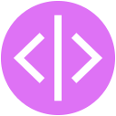

<p align="center">
  
  
</p>

<h1 align="center">Hola, soy Roxy 👋</h1>
<p align="center">Desarrolladora en COSNTANTE formación • Voluntaria digital • Enfocada en crear impacto social desde Canarias</p>

<p align="center">
  
  
  
  
  
  
</p>

---

### 🚀 Sobre mí

🌱 Actualmente estoy aprendiendo **Swift**, **SwiftUI** **Flutter** para desarrollar aplicaciones iOS y Android con propósito social.

💡 Mi enfoque está en el desarrollo de **apps inclusivas y comunitarias**, como **Canari@Conecta**, una plataforma para conectar personas voluntarias con quienes más lo necesitan en las Islas Canarias.

🌍 Interesada en proyectos de **tecnología cívica**, **educación digital**, **voluntariado tech** y dar rienda suelta a la creatividad.

📚 Me gusta compartir recursos y crear soluciones accesibles, usando herramientas y frameworks que agilicen y optimicen mi workflow.

💬 Siempre dispuesta a colaborar o intercambiar ideas sobre:
- Apps low-code / high-code
- Desarrollo de PWAs, móviles y web
- Alfabetización digital
- Video Streaming
- Proyectos educativos y comunitarios
- Fotografía

---

### 🛠️ Tecnologías y herramientas

<p>
  
  
  
  
  
  
  
  
  
  
  
</p>

---

### 🧠 En proceso de aprendizaje

```swift
import SwiftUI

struct LearningPath: View {
    var body: some View {
        VStack {
            Text("📱 Swift y SwiftUI")
            Text("☁️ Backend con Supabase")
            Text("⚙️ Laravel + MySQL + Docker")
            Text("🌐 Desarrollo de PWAs")
        }
    }
}
```

### 🌐 Conecta conmigo

- 🔗 [LinkedIn](https://www.linkedin.com/in/roxy-perez/)
- 🌐 [Sitio personal / portfolio](https://roxy-perez.netlify.app/)
- 💌 Email: necropsia32@gmail.com

<p align="center">
  <a href="https://www.linkedin.com/in/roxy-perez/" target="_blank">
    
  </a>
</p>

<p align="center">
  
</p>

